# Implementar pasarela de Pago - EVIDENCIA GRUPAL

# Clonar repositorio

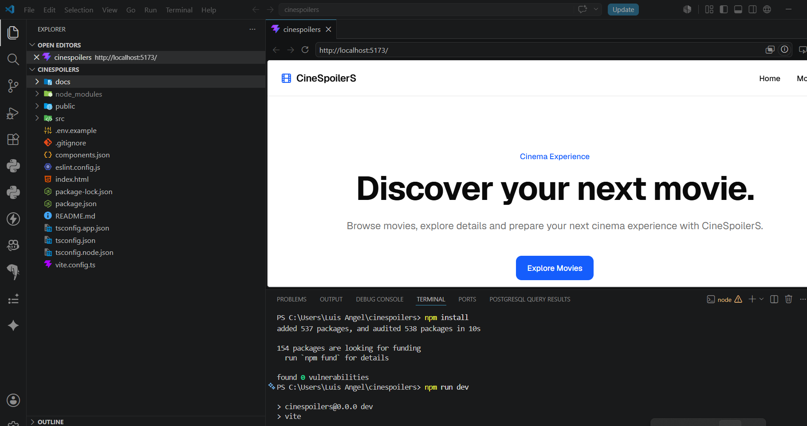

# Levantar proyecto

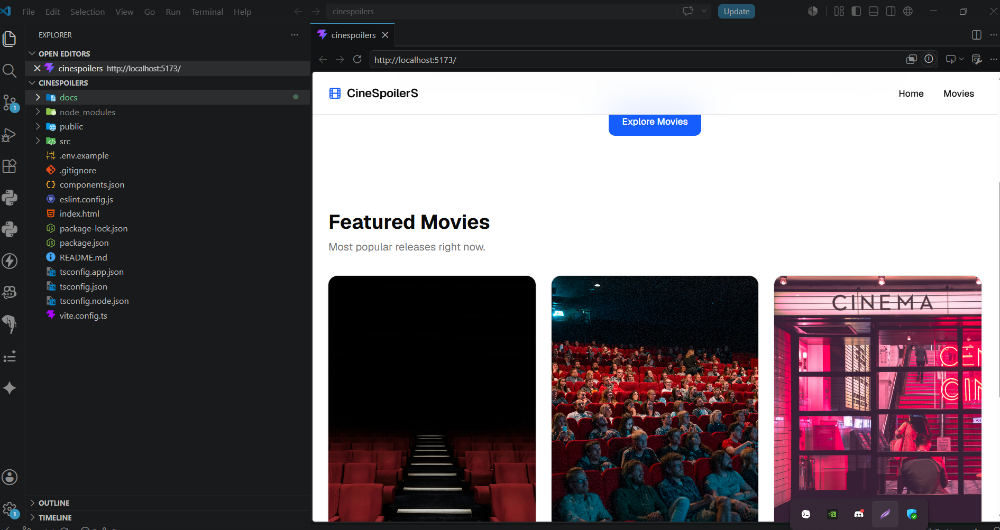

# Consumir data de TMDB

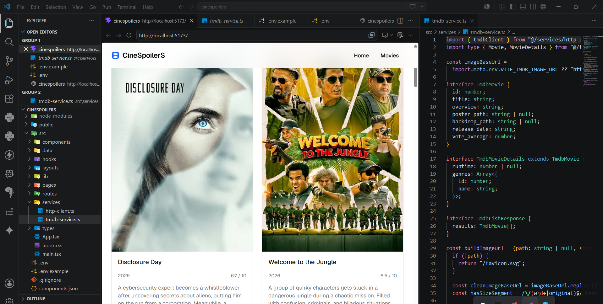

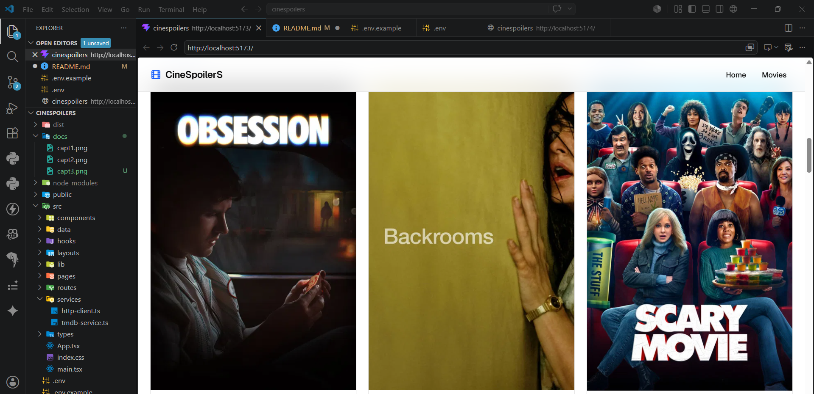

# Implementar estado global (Zustand)
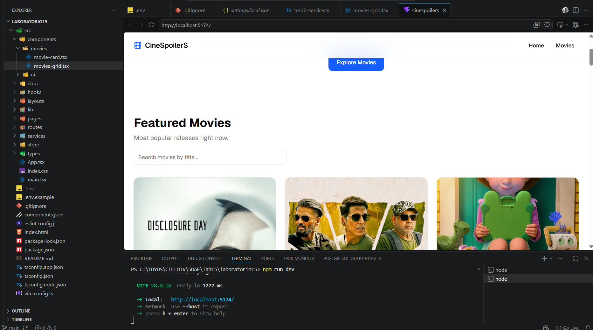

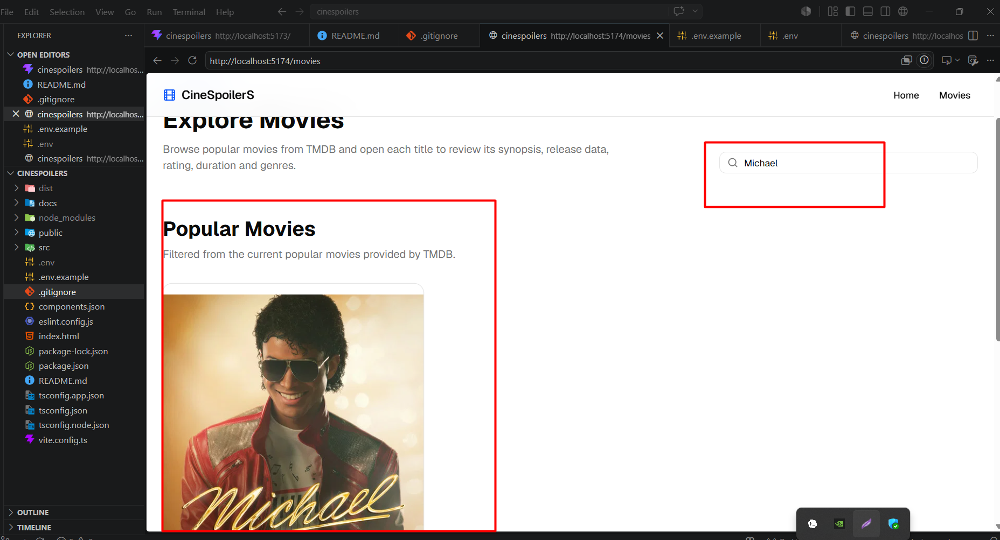

# Desarrollar todas los pages * diferente rutas con puerto

... PAGES HOME
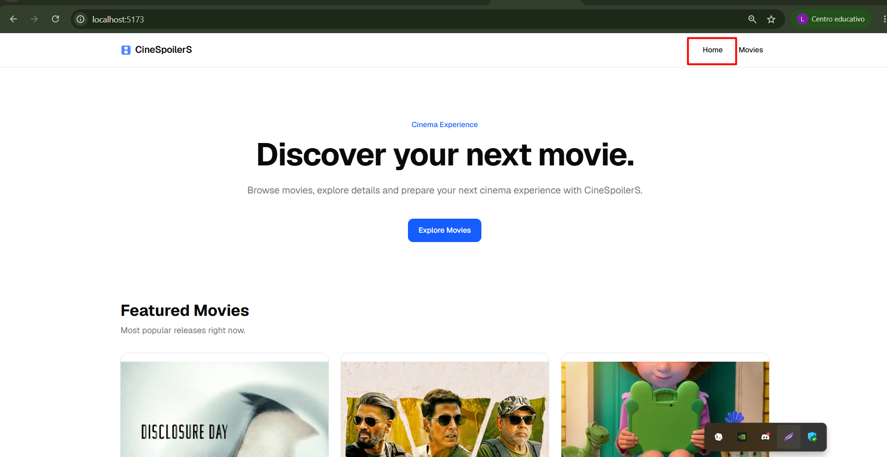

... PAGES MOVIES
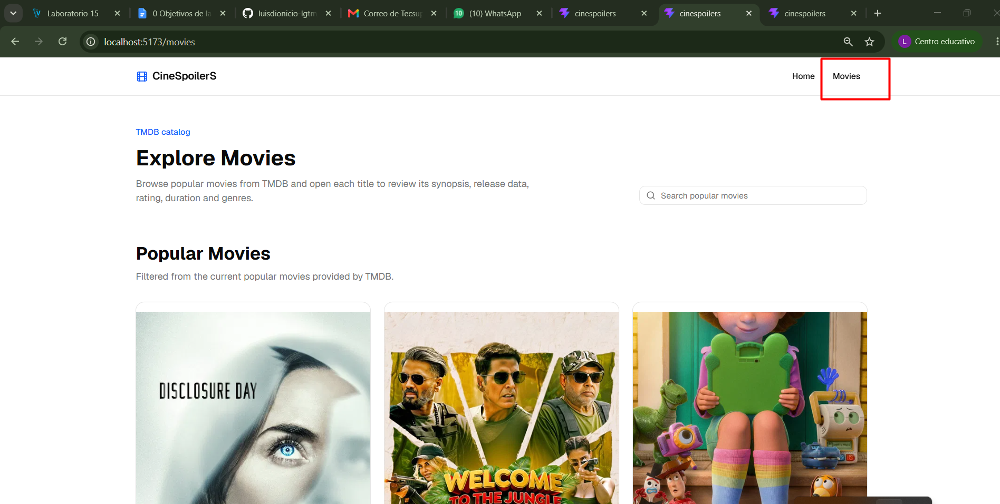

... VIEWDETALLES

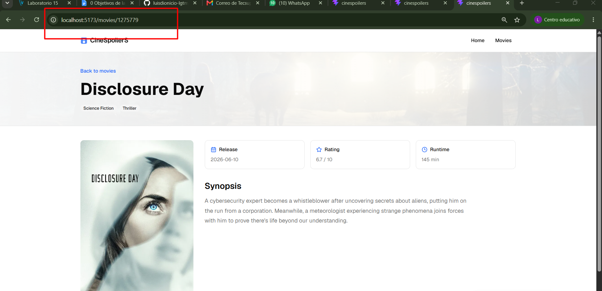

# Agregar pasarela de pagos de película comprada (Simulación)

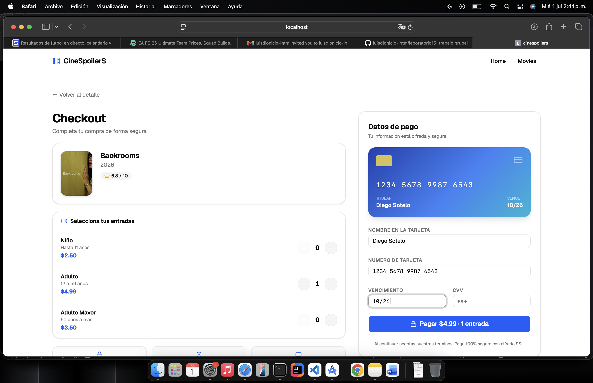

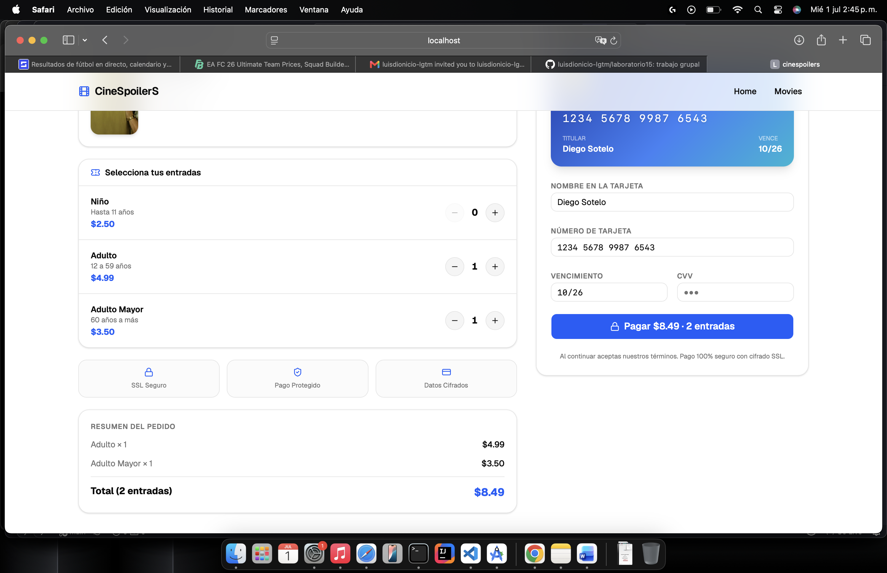

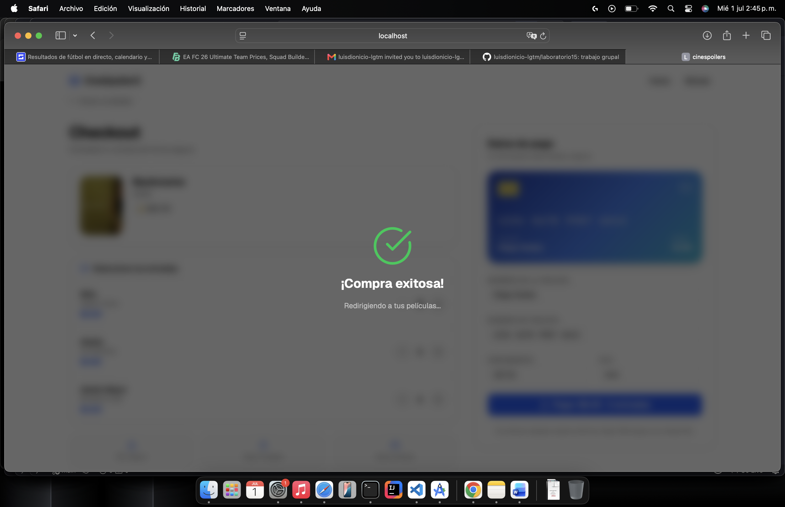

# Agregar tests al proyecto

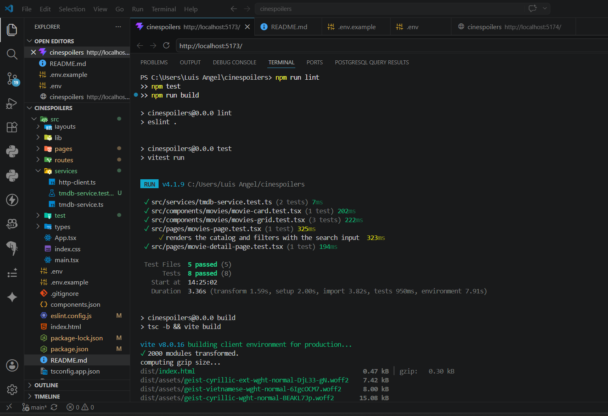